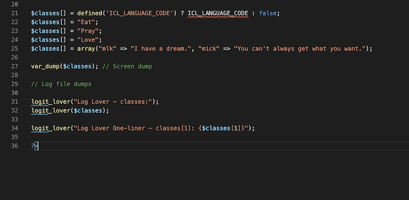
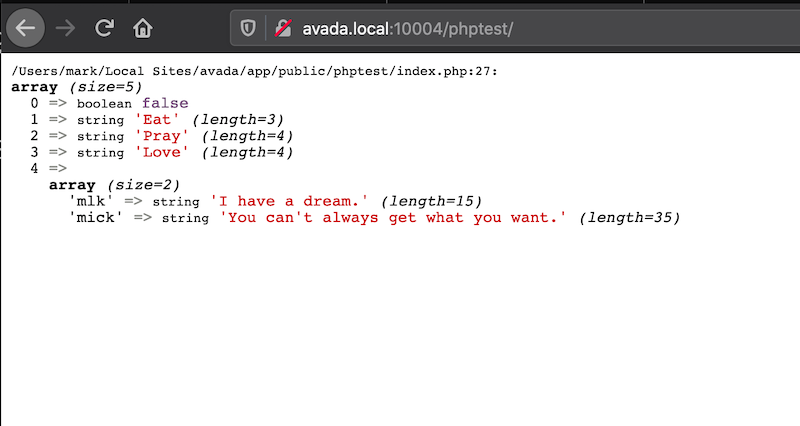
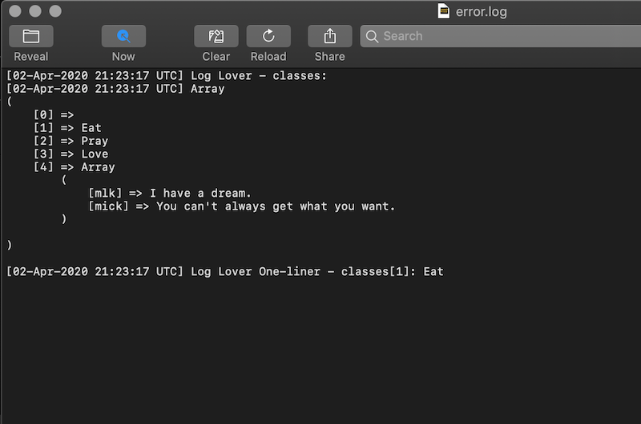

# Log Lover

Contributors: mlchaves
Donate link: https://ko-fi.com/marklchaves
Tags: debug, log, logging, errors
Requires at least: 5.3.2
Tested up to: 5.3.2
Stable tag: 1.0.0
Requires PHP: 7.2.18
License: GPLv2 or later
License URI: https://www.gnu.org/licenses/gpl-2.0.html

Simplifies writing to debug.log.

## Description

## Installation

1. Upload the plugin files to the `/wp-content/plugins/log-lover` directory.
1. Activate the plugin through the 'Plugins' screen in WordPress

## Usage

### WordPress 

For WordPress, enable debug mode. Add these lines to your `wp-config.php` file.

```bash
// Enable WP_DEBUG mode
define( 'WP_DEBUG', true );

// Enable Debug logging to the /wp-content/debug.log file
define( 'WP_DEBUG_LOG', true );

// Disable display of errors and warnings
define( 'WP_DEBUG_DISPLAY', false );
@ini_set( 'display_errors', 0 );
```

[Reference](https://wordpress.org/support/article/debugging-in-wordpress/)

---

### PHP Code

#### Simple text string.

`logit_lover( "Hello World!" );`

#### One-liner text with simple variable (i.e. not an array).

`logit_lover( "Here's my_var: {$my_var}" );`

#### Two-liner text with an array.

```php
logit_lover("Log Lover - classes:"); 
logit_lover($classes);
```

#### Stringing variables along for the ride.

```php
logit_lover("Log Lover One-liner - classes[1]: {$classes[1]} {$testVar}");

logit_lover($classes[2] . " " . $testVar);
```

---

## Screengrabs

Below is a PHP code snippet that uses Log Lover and thee `var_dump()` function as a comparison.



Below is the `var_dump()` output that displays right on a web page.



Below is the output from Log Lover that's stored in the debug log file.



---

## I'll Drink to That ;-)

[](https://ko-fi.com/D1D7YARD)
